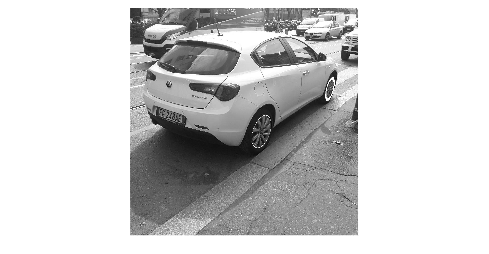
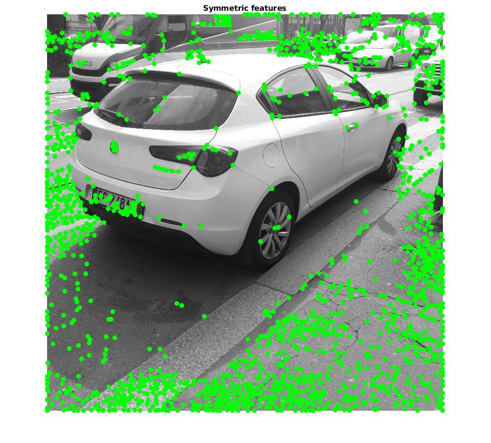
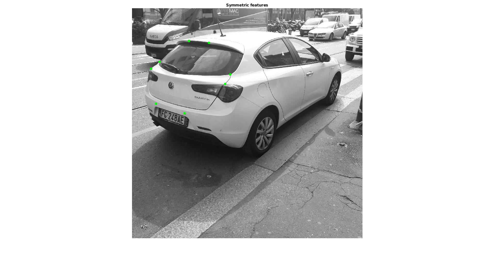
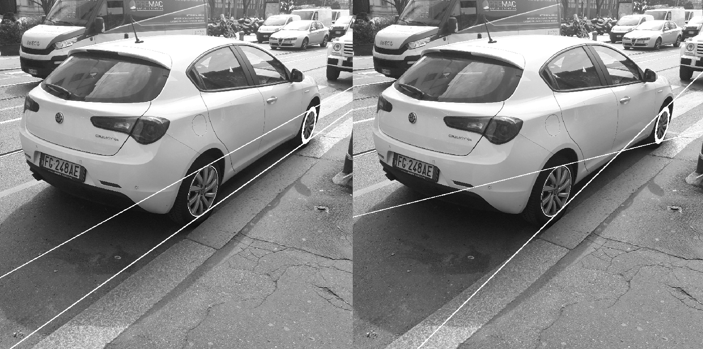
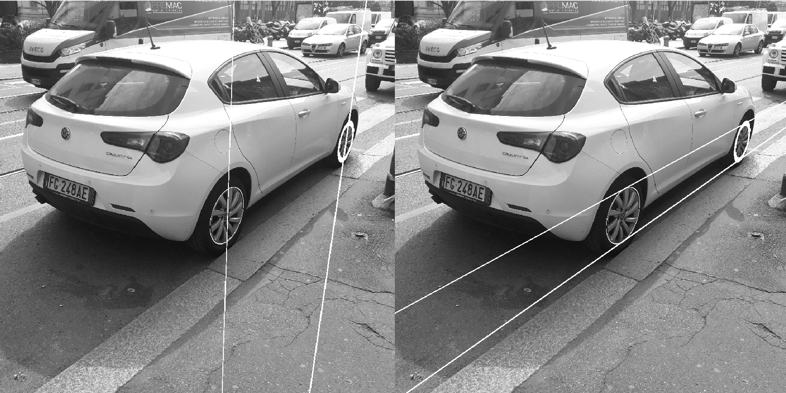
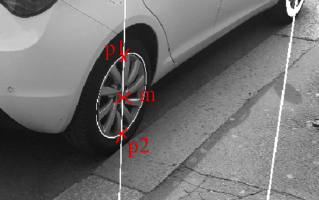
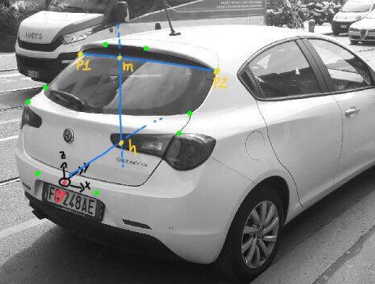
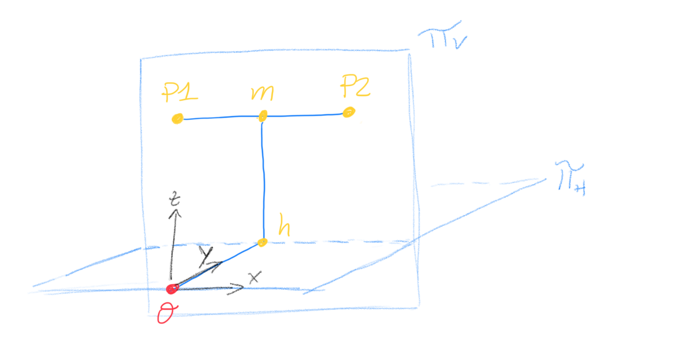
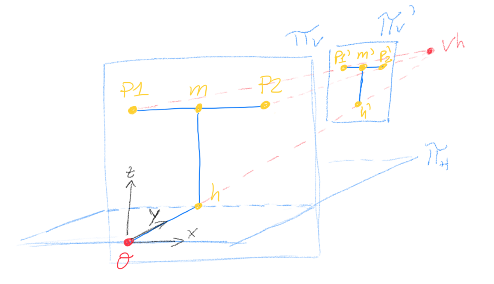
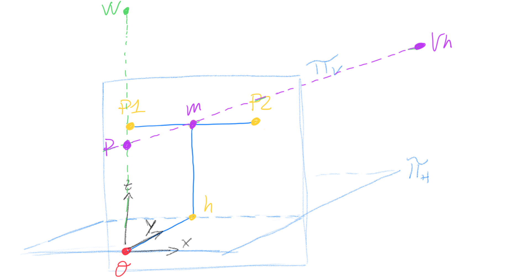

# Report

### Summary
The code is divided in 6 sections:
 - Setup
 - Features selection
 - Wheels' plane rectification
 - Camera Calibration
 - 3D points reconstruction
 - Camera Pose Estimation

## Setup
The setup of the image consists in:
  - making the image square
  - making the image grayscale


## Features selection
- Find the wheels' ellipses
  - I've used a matlab function called regionprops to find all the ellipses in the image
    ```matlab
    s = regionprops(bw,{...
    'Centroid',...
    'MajorAxisLength',...
    'MinorAxisLength',...
    'Orientation'});
    ```
  - I've created a filter to find exactly the wheels' ellipses as follows:
    ```matlab
    a = s(k).MajorAxisLength/2;
    b = s(k).MinorAxisLength/2;
    ruota_anteriore = (a>100 & b>45 & a<300 & b<300 & abs(a-b)>0.6*max(a,b));
    ruota_posteriore = (a>100 & b>100 & a<300 & b<300);
    ```
  - I've converted the information given by the function regionprops (Center, Orientation, etc...) into a matrix rappresenting the conic.
    ```matlab
    c0 = ((cos(phi))^2)/(a^2)...
        + ((sin(phi))^2)/(b^2);

    c1 = ((sin(phi))^2)/(a^2)...
        + ((cos(phi))^2)/(b^2);

    c2 = (sin(2*phi))/(a^2) ...
        - (sin(2*phi))/(b^2);

    c3 = -(2*Xc*(cos(phi))^2)/(a^2) ...
        - (Yc*sin(2*phi))/(a^2) ...
        - (2*Xc*(sin(phi))^2)/(b^2) ...
        + (Yc*sin(2*phi))/(b^2);

    c4 = - (Xc*sin(2*phi))/(a^2) ...
        - (2*Yc*(sin(phi))^2)/(a^2) ...
        + (Xc*sin(2*phi))/(b^2) ...
        - (2*Yc*(cos(phi))^2)/(b^2);

    c5 = ((Xc^2)*(cos(phi))^2)/(a^2) ...
        + (Xc*Yc*sin(2*phi))/(a^2) ...
        + ((Yc^2)*(sin(phi))^2)/(a^2) ...
        +((Xc^2)*(sin(phi))^2)/(b^2) ...
        - (Xc*Yc*sin(2*phi))/(b^2) ...
        + ((Yc^2)*(cos(phi))^2)/(b^2) ...
        - 1;
    C_ant=[c0 c2/2 c3/2; c2/2 c1 c4/2; c3/2 c4/2 c5];
    C_ant=C_ant/C_ant(3,3);

    ```
    The result is this:
    

- Find some pairs of symmetric points
  - I've used the Harris approach to find all the corners in the image.
    - I've followed the following step:
        1. I have calculated the horizontal and vertical derivatives of the image by the convolution with the Prewitt mask, as follows:
        ```matlab
        dx = [-1 0 1; -1 0 1; -1 0 1];   % Derivative masks
        dy = dx';

        Ix = conv2(im_orig, dx, 'same');      % Image derivatives
        Iy = conv2(im_orig, dy, 'same');
        ```
        2. Then I've calculated the cim matrix:
        ```matlab
        % set the parameter for Gaussian convolution used in Harris Corner Detector
        SIGMA_gaussian=4;
        g = fspecial('gaussian',max(1,fix(3*SIGMA_gaussian)+1), SIGMA_gaussian);

        Ix2 = conv2(Ix.^2, g, 'same'); % Smoothed squared image derivatives
        Iy2 = conv2(Iy.^2, g, 'same');
        Ixy = conv2(Ix.*Iy, g, 'same');


        % cim = det(M) - k trace(M)^2.
        % cim is large means that the eigenvalues of matrix M is large
        k = 0.04;
        cim = (Ix2.*Iy2 - Ixy.^2) - k * (Ix2 + Iy2)
        ```
        3. Then I've applied a threshold and I've picked the maximum over a square neighbor of 30x30  
        ```matlab
        T=mean(cim(:));
        CIM=cim;
        CIM(find(cim<T))=0;

        support=true(30);
        maxima=ordfilt2(CIM,sum(support(:)),support);
        [loc_i,loc_j]=find((cim==maxima).*(CIM>0));
        ```
    The result is this:
    

  - I've imported some coordinates of symmetric points manually taken.
  - I've selected, from the set of corners found, the closest ones to the points imported  
  ```matlab
    load('symmetricPoints.mat'); %load x and y variales
    symP=[x y];
    eps= 200;
    ind=[];

    %I'm parsing all the corner found, and I'll save the ones very close to the points loaded
    for(i=1:size(symP,1))
        for(j=1:size(loc_i,1))
            point=symP(i,:);
            error = (point(2)-loc_i(j)).^2+(point(1)-loc_j(j)).^2;
            if(error<eps)
                ind=[j; ind];
            end
        end
    end
  ```
  The result is this:
  


## Wheels' plane rectification
In order to rectify the plane where the rims lie, I've only considered the conics found before. (Let's call them C1 and C2)
- I've found the lines tangent both to C1 and C2, computing the intersection of the two respective dual conics.

- Crossing lines l2 and l3 (the pair of lines in the left image) I've been able to find the first vanishing point (called vh)
- Computing the intersection between l2, l3 and the two conics C1 and C2 I've found the tangent points and I've used them to find two vertical parallel lines. Hence, I've found the second vanishing point (called vv)

- I've found the line at the infinity, intersecting the two vanishing points vv and vh.
- I've found the circular points I and J by the intersection of a conic (C1 or C2, the result doesn't change) with the line at the infinity.
- I've found the transformation Hr by the single value decomposition of the dual conic called dualCinf=I*J'+J*I'

  ```matlab
  dualCinf=I*J'+J*I';
  [U S V]=svd(dualCinf)
  S1=[(S(1,1))^(0.5)         0             0; ...
             0         (S(2,2))^(0.5)      0; ...
             0               0             1    ];
  % Let dCinf=[1 0 0; 0 1 0; 0 0 0]
  % Note that S = S1*dCinf*S1, hence...
  % dualCinf=(U*S1)*dCinf*(V*S1)'
  Hr=inv(U*S1);
  Hr=Hr/Hr(3,3);
  ```
Now in order to evalute the ratio between the diameter and the wheel-to-wheel distance, I've followed the following steps:
- I've found the centers of the rims, fixing the cross ratio between p1, p2, m and vv to -1, where:
  - p1 and p2 are the tangent points to the conic of the rear wheel w.r.t. l2 and l3
  - m is the center of the rim
  - vv is the vertical vanishing point, found before
  - 
- I've traspormed the two centers m_rear, m_front and the two points p1 and p2 by the transformation matrix found Hr.
- Hence I've calculated the distance between m_rear and m_front and between p1 and p2 and I've evaluated the ratio.
  \[
  ratio = \frac{distance(Hr*p1, Hr*p2)}{distance(Hr*m_{rear} ,Hr*m_{front})}
  \]

The result is he following:
```
result =

    0.2166
```
In order to check if the transformation matrix found is acceptable, I've transformed both the diameters of the rims of the car and I've evaluated their lenghts.
```matlab
left1_trasf=Hr*left1;
left1_trasf=left1_trasf/left1_trasf(3);

left2_trasf=Hr*left2;
left2_trasf=left2_trasf/left2_trasf(3);

diamLtrasf = [left1_trasf left2_trasf];


right1_trasf=Hr*right1;
right1_trasf=right1_trasf/right1_trasf(3);

right2_trasf=Hr*right2;
right2_trasf=right2_trasf/right2_trasf(3);

diamRtrasf = [right1_trasf right2_trasf];

fprintf('CHECK: The diameter of the two wheel circle are the same after transformation')
Lenght(diamLtrasf)
Lenght(diamRtrasf)
```
The following result shows, as could be expected, that the diameters have preciselly the same lenghts:
```
CHECK: The diameter of the two wheel circle are the same after transformation
ans =

    0.1931


ans =

    0.1931
```

## Camera Calibration
The camera is zero-skew but not natural, so the calibration matrix should have this form:
\[
   K=
  \left[ {\begin{array}{cc}
   f_x & 0   & u_x\\
   0   & f_y & u_y\\
   0   & 0   & 1\\
  \end{array} } \right]
\]

Since there are 4 unknowns, I need at least 4 equations to solve the camera calibration problem. Let's consider the image of the absolute conic
\[
\omega =(KK^T)^{-1}=
\left[ {\begin{array}{cc}
 1/f_x^2        & 0          & -u_x/f_x^2\\
 0             & 1/f_y^2     & -u_y/f_y^2\\
 -u_x/f_x^2      & -u_y/f_y^2   & (f_x^2*f_y^2 + f_x^2*u_y^2 + f_y^2*u_x^2)/(f_x^2*f_y^2)\\
\end{array} } \right]

\]

I've found the first three equations thanks to the ortogonal relation between the three following vanishing points:
- vh: horizontal vanishing point (found before)
- vv: vertical vanishing point (found before)
- vl: lateral vanishing point, that is the point where all the parallel lines, joining the pairs of symmetric points, meet.
    - To evaluate this last vanishing point I've used all the pairs of symmetric points found, in order to minimize the effect of noise due to features' selection. The reasoning is the following:
        1. Take two generic pair of symmetric points
        2. Join the two pair of points in order to find two lines l1 and l2 (that are parallel in the real world)
        3. Calculate the intersection between l1 and l2 and add the result to the list setOfVl.
        4. Repeat from step 1 until all the possibile combinations have been evaluated
        5. vl is the centroid of the points in setOfVl. The result is:
        ```
        vl =

           1.0e+03 *

           -3.4057
            0.0522
            0.0010
        ```

Hence, the first three equations are:
\[
\begin{cases}
vh^T*\omega*vv & = & 0 \\
vh^T*\omega*vl & = & 0 \\
vl^T*\omega*vh & = & 0 \\
\end{cases}
\]

Now, In order to find the last equation I can use two different way:
1. By circular points
2. By other pair of parallel lines

####First approach

I can find the other equation thanks to the circular points found in the wheels' plane rectification section. Since the image absolute conic is the locus of all the image of the circular points, I and J belong to the image of the absolute conic. So I can write:
\[
\begin{cases}
I^T*\omega*I & = & 0 \\
J^T*\omega*J & = & 0 \\  
\end{cases}
\]

Thus, I can choose one of the two equations and solve the following system of four equations in four variables.

\[
\begin{cases}
I^T*\omega*I & = & 0 \\
vh^T*\omega*vv & = & 0 \\
vh^T*\omega*vl & = & 0 \\
vl^T*\omega*vh & = & 0 \\
\end{cases}
\]

This can be solved with the _solve_ function of matlab:
```matlab
eq1=I'*w*I;
eq3 = vh'*w*vv;
eq4 = vh'*w*vl;
eq5 = vl'*w*vv;

eqs=[eq1;eq2;eq3;eq4;eq5];

k_par=solve(eqs, [fx fy ux uy]);
```
The result of this first approach is:
```
K =
   1.0e+03 *
    4.1111         0    1.5076
         0    4.7789    1.9869
         0         0    0.0010
```
####Second approach
I can also find the last equation consider the rear rim and following this reasoning:

- Interpolate the two centers of the rear and front rims to find the line called _line_joining_centers_
- Intersect this line with the conic of the rear rim to find to two points (p_right and p_left)
- I also know the coordinates of the points resulting from the intersection between the line, joining m with the vertical vanishing point, and the conic. Let's rename them p_up and p_down.
- Notice that p_up, p_left, p_down, p_right rapprent the vertices of a square (that has trivially parallel sides)
- So I can find the two vanishing points as follows:
    ```matlab
    v1=cross(cross(p_up,p_right),cross(p_down,p_left))
    v1=Normalize("vector", v1);

    v2=cross(cross(p_up,p_left),cross(p_down,p_right))
    v2=Normalize("vector", v2);
    ```
So, the system to solve is:
\[
\begin{cases}
v1^T*\omega*v2 & = & 0 \\
vh^T*\omega*vv & = & 0 \\
vh^T*\omega*vl & = & 0 \\
vl^T*\omega*vh & = & 0 \\
\end{cases}
\]

This is the approach that I've decided to use in the code, and the result is:
```
K =

   1.0e+03 *

    3.3355         0    1.5929
         0    3.5217    1.7725
         0         0    0.0010

```

## 3D points reconstruction


In order to reconstruct the 3d coordinates of the point, I've followed the following steps:
1. I've fixed the origin in the middle point (calculated by the cross ratio) of the lower symmetric points
2. Now for each pair of symmetric point p1, p2 I have followed the following steps:
    1. Calculate the middle point m (setting CR = -1)
    2. Find point h as the intersection between the y-axis and the horizontal lines passing through m
    3. The coordinates on the image plane are:
        - P1 = (- distance(p1,m), distance(o,h), distance(m,h))       
        - P2 = (  distance(p2,m), distance(o,h), distance(m,h))
3. Rectify the planes where p1, p2, m, h and o lie and then it's enough to evaluate the above distances with the transfomed points.
  
To rectify the planes I've followed the following reasoning:
    - PLANE V:
        - Let's find the circular points by the intersection between the image of the absolute conic (found by calibration) and the line at infinity (easily found interpolating vl and vv)
        - Then it's easy to find the matrix of rectification with the single value decomposition.
    - PLANE H
        - I've done the same steps but with vh instead vv

    This reasoning can easy be implemented as follows:
    ```matlab
    %PLANE V
    line_inf=cross(vl,vv);
    line_inf=line_inf/line_inf(3);
    circPointsV = IntersectionLineConic(iac,line_inf);
    I=circPointsV(:,1);
    J=circPointsV(:,2);
    dualCinf=I*J'+J*I';
    [U S V]=svd(dualCinf)
    S1=[(S(1,1))^(0.5)         0             0; ...
               0         (S(2,2))^(0.5)      0; ...
               0               0             1    ];
    Hv=inv(U*S1);
    Hv=Hv/Hv(3,3)

    %PLANE H
    % ..... the same with vh instead vv ....
    ```
    - Then I've used the lower pair of symmetric points (that lie both in plane_h and in plane_v) to scale the matrices in such a way they transform the segment joining the two points in two segments with the same lenght.
        ```matlab
        segv=Lenght(Hv*[p1, p2])
        segh=Lenght(Hh*[p1,p2])
        Hv=[segh/segv 0 0; 0 segh/segv 0; 0 0 1]*Hv
        ```
    - Now for each pair of symmetric points I can use Hh to transform the segment o-h that identify the y-coordinate.

    - However, I cannot use simply Hv to transform the segments h-m, m-p1, m-p2 (that identify the x and z coordinates). I need another scale factor due to prospective. For instance, if I didn't consider this factor, in the image below, the segment m-p1 and m'-p1' would be map in two segments with different lenghts even if they are equal in the real world.
    
    I've evaluated this scale factor as follows.
    
    - I've found the point p as cross(cross(o,vv),cross(m,vh))
    - Then the scale factor is:
    \[ s=\frac{distance(vh,p)}{distance(vh,m)} \]
    - Hence, for each pair of symmetric points p1, p2 I can define s = f(p1,p2) and finally transform the segments that identify x and z coordinates, scaling Hv as follows:
    ```matlab
    s=Distance(vh,p)/Distance(vh,m) %SCALE FACTOR DUE TO PROSPECTIVE
    scaling=[s 0 0; 0 s 0; 0 0 1];
    Hv=scaling*Hv
    ```

    Thus, for each symmetric points p1, p2 I've used the following instructions:
    ```matlab
    m = MiddlePointByCR(p1,p2,vl);
    x1 = [m,p1];
    x2 = [m,p2];

    vert_axis_through_m=cross(m,vv);
    vert_axis_through_m=vert_axis_through_m/vert_axis_through_m(3);

    y_axis=cross(o,vh);
    y_axis=y_axis/y_axis(3);

    h = cross( y_axis, vert_axis_through_m );
    h=h/h(3);

    z1 = [m,h];
    z2 = z1;

    y1 = [h,o];
    y2 = y1;

    p=cross(cross(o,vv),cross(m,vh));
    p=Normalize("vector", p);
    s=Distance(vh,p)/Distance(vh,m) %SCALE FACTOR DUE TO PROSPECTIVE
    scaling=[s 0 0; 0 s 0; 0 0 1];
    %Let's transform the segments
    segment_x1=Normalize("segment", scaling*Hv*x1);
    segment_y1=Normalize("segment", Hh*y1);
    segment_z1=Normalize("segment", scaling*Hv*z1);

    segment_x2=Normalize("segment", scaling*Hv*x2);
    segment_y2=Normalize("segment", Hh*y2);
    segment_z2=Normalize("segment", scaling*Hv*z2);

    %Let's find the real coordinates

    realx1=   Distance(segment_x1(:,1),segment_x1(:,2));
    realy1=   Distance(segment_y1(:,1),segment_y1(:,2));
    realz1=   Distance(segment_z1(:,1),segment_z1(:,2));

    p_left=[realx1; realy1; realz1; 1];

    realx2= - Distance(segment_x2(:,1),segment_x2(:,2));
    realy2=   Distance(segment_y2(:,1),segment_y2(:,2));
    realz2=   Distance(segment_z2(:,1),segment_z2(:,2));

    p_right=[realx2; realy2; realz2; 1];

    worldPoints = [worldPoints, p_left, p_right];
    ```
And so, the result optained is:
```
worldPoints =

   -0.0049  0.0049 -0.0012  0.0012 -0.0021  0.0021 -0.0045  0.0045
    0.0048  0.0048  0.0100  0.0100       0       0  0.0071  0.0071
    0.0048  0.0048  0.0092  0.0092       0       0  0.0056  0.0056
    1.0000  1.0000  1.0000  1.0000  1.0000  1.0000  1.0000  1.0000

```

## Camera Pose Estimation
At this point there could be some confusion about notation, so it could be useful to make a brief about the reference frames that will be considered soon:
- **Camera frame**: It's the frame on the camera that I want to infer
- **Car frame**: It's the frame that I've fixed on the car. The points inside the matrix called *worldPoints* are expressed in this frame.
- **World frame**: It's the fixed reference frame of the world. I've decided to place this frame preciselly coincident to the Camera frame.

Now what I want to do is to fit the 3D points found with the relative 2D points in the image.
\[
imagePoint_{3 \times 1} = H_{3 \times 4} * worldPoint_{4 \times 1}
\]

\[
\left[ {\begin{array}{cc}
 i1 \\
 i2  \\
 1  \\
\end{array} } \right]
   =
  \left[ {\begin{array}{cc}
   h11   & h12   & h13 & h14 \\
   h21   & h22   & h23 & h24 \\
   h31   & h32   & h33 & h34 \\
  \end{array} } \right]
\times
  \left[ {\begin{array}{cc}
   x \\
   y   \\
   z   \\
   1   \\
  \end{array} } \right]
\]

This operation, computed for all the n points found, is equal to the following operation:

\[
imagePoints_{3 \times n} = H_{3 \times 4} * worldPoints_{4 \times n}
\]

Where worldPoints is the matrix shown in the previous section, and imagePoints is the following:
```
imagePoints =

         257    125     76    1033    324     70    374   1323
         816   1022    441     465   1287   1415     72    892
           1      1      1       1      1      1      1      1

```

Hence H can be easily found as follows:
```matlab
H=imagePoints/worldPoints; %x = B/A solves the system x*A = B
```
We know from the Projection Theory that the relation between the imagePoints and the worldPoints is the following:
\[
imagePoints_{3 \times n} = \left[ {\begin{array}{cc} K_{3 \times 3}R_{c->w} & -K_{3 \times 3}R_{c->w}\theta \end{array} } \right] * A_{4 \times 4} * worldPoints_{4 \times n}
\]

where A is the transformation matrix from car frame to world frame. Since I've decided to place the world frame preciselly on the camera frame, the rotation matrix R form the camera to the world frame becomes the identity matrix **I**, and the traslation vector **θ** become 0. This relation becomes:
\[
imagePoints_{3 \times n} = \left[ {\begin{array}{cc} K_{3 \times 3} & 0_{3 \times 1} \end{array} } \right] * A_{4 \times 4} * worldPoints_{4 \times n}
\]

At this point, A is the transformation matrix from the car frame to the camera frame.

Thus,

\[
H_{3 \times 4} =  \left[ {\begin{array}{cc} K_{3 \times 3} & 0_{3 \times 1} \end{array} } \right] * A_{4 \times 4}
\]

And so A can be found as follows:
```matlab
KO=[K zeros(3,1)];
A=KO\H; %x = A\B solves the system A*x = B
```
Once I have the trasformation matrix A from the Car frame to the Camera frame, it's easy to find the inverse matrix A_inv:

If A has this form:
\[
A
   =
  \left[ {\begin{array}{cc}
   R_{3 \times 3}   & t_{3\times 1} \\
   0_{1\times 3} & 1  \\
  \end{array} } \right]
\]

A_inv has the following form:

\[
A_{inv}
   =
  \left[ {\begin{array}{cc}
   R^T_{3 \times 3}   & -R^T_{3 \times 3} t_{3\times 1} \\
   0_{1\times 3} & 1  \\
  \end{array} } \right]
\]

Hence to find the location of the camera it's enough to pick the last colomn of this matrix.

\[
cameraLocation
   =
  \left[ {\begin{array}{cc}
   R^T_{3 \times 3}   & -R^T_{3 \times 3} t_{3\times 1} \\
   0_{1\times 3} & 1  \\
  \end{array} } \right]
  \times
  \left[ {\begin{array}{cc}
   0\\
   0\\
   0\\
   1\\
  \end{array} } \right]
=
\left[ {\begin{array}{cc}
 -R^T_{3 \times 3} t_{3\times 1} \\
  1  \\
\end{array} } \right]
\]


Unfortunately, when I implement this reasoning in matlab something goes wrong and the result can not be acceptable, since the rotation matrix R inside A is not orthogonal.
```matlab
H=imagePoints/worldPoints;

KO=[K zeros(3,1)];
A=KO\H;

worldOrientation=A(1:3,1:3);
worldLocation=A(1:3,4);

Ainv=[worldOrientation, -worldOrientation'*worldLocation];
Ainv=[Ainv; 0 0 0 1]

camera=Ainv*[0;0;0;1]
```
This is the result:
```
Ainv =

   30.7591   16.9482   -5.7640   10.3985
    5.8781   -3.2032  -24.1700    4.9773
    0.0000    0.0000   -0.0000   -4.6423
         0         0         0    1.0000


camera =

   10.3985
    4.9773
   -4.6423
    1.0000
```
